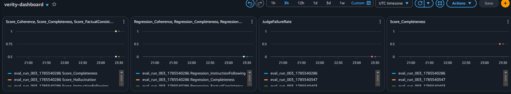

# Verity — LLM Evaluation and Monitoring System

An end-to-end LLM evaluation platform for document summarization. The summarization is not the point — the evaluation, calibration, and regression detection are.

## What it does

Verity runs a document summarization pipeline, evaluates outputs across five failure categories using a calibrated LLM judge, tracks scores over time, and alerts when model quality regresses. A model can produce outputs that are fluent, plausible, and wrong — and without a structured evaluation layer, that degradation is invisible until a user notices it. Verity makes model quality observable.

- **Summarization** — DistilBART processes S&P 500 earnings call transcript chunks served via FastAPI on AWS ECS Fargate
- **Evaluation** — Gemini 2.5 Flash judge scores each output across five failure categories with schema validation on every response
- **Calibration** — judge calibrated against a 57-example human-labeled validation set achieving 86.7% average agreement across all categories
- **Monitoring** — run-over-run score deltas computed via Lambda, 13 metrics pushed to CloudWatch, SNS alerts on regression detection with per-category severity thresholds

## Architecture

```
                          ┌─────────────────────────────────────────┐
                          │              S3 (Documents)              │
                          │     Earnings call transcript chunks      │
                          └──────────────────┬──────────────────────┘
                                             │
                                             ▼
┌──────────────┐    POST /summarize   ┌─────────────────┐    writes    ┌─────────────────────┐
│    Client    │ ──────────────────► │   ECS Fargate   │ ───────────► │      DynamoDB       │
└──────────────┘                     │  FastAPI + BART │              │  pipeline_outputs   │
                                     └─────────────────┘              └──────────┬──────────┘
                                                                                  │
                              ┌───────────────────────────────────────────────────┘
                              │
                              ▼
                    ┌──────────────────┐    evaluates    ┌─────────────────┐
  EventBridge ────► │     Lambda       │ ──────────────► │  Gemini 2.5     │
  (cron, disabled)  │   Evaluation     │                 │  Flash Judge    │
                    │    Runner        │ ◄───────────────┘
                    └────────┬─────────┘    scores
                             │
              ┌──────────────┼──────────────┐
              │              │              │
              ▼              ▼              ▼
     ┌─────────────┐  ┌──────────┐  ┌──────────────┐
     │  DynamoDB   │  │CloudWatch│  │     SNS      │
     │ eval_results│  │ 13 metrics│  │   Alerts     │
     └─────────────┘  └──────────┘  └──────────────┘
```

**API Routes:**
- `GET /health` — ECS health check
- `POST /summarize` — fetch chunk from S3, run DistilBART, write to DynamoDB
- `GET /results/{doc_id}` — retrieve pipeline outputs for a document
- `GET /runs/{run_id}` — retrieve all outputs for a run (used by Lambda evaluation runner)

## Evaluation Methodology

### Failure Mode Taxonomy

Five failure categories are evaluated on each summary, scored 0 (fail), 0.5 (marginal), or 1 (pass):

| Category | What it detects | Severity |
|---|---|---|
| Hallucination | Content invented from outside the source document | Critical |
| Factual Consistency | Claims that contradict or distort the source | High |
| Completeness | Material information absent from the summary | High |
| Instruction Following | Format or constraint violations | Medium |
| Coherence | Internal contradictions or structural failures | Low-Medium |

Regression alerts are severity-tiered: hallucination and factual consistency trigger immediate SNS notification; completeness, coherence, and instruction following require consecutive regressions before alerting.

### Calibration

The Gemini 2.5 Flash judge was calibrated against a 57-example human-labeled validation set before integration into the automated pipeline. The validation set includes 50 organic DistilBART outputs and 7 synthetic pairs constructed to ensure calibration coverage across all five failure categories.

**Calibration results (final run):**

| Category | Agreement | False Positive Rate | False Negative Rate |
|---|---|---|---|
| Factual Consistency | 78.9% | 5.3% | 14.0% |
| Completeness | 77.2% | 0.0% | 7.0% |
| Coherence | 89.5% | 1.8% | 0.0% |
| Hallucination | 91.2% | 1.8% | 7.0% |
| Instruction Following | 96.5% | 0.0% | 3.5% |
| **Average** | **86.7%** | | |

Target threshold: 75% agreement per category. All five categories pass.

The false-negative-dominant pattern on factual consistency and completeness means the judge is slightly stricter than human labels on those categories — it catches failures that humans passed. This is the preferred direction for a production monitoring system: false alarms are preferable to missed regressions.

Judge responses are schema-validated on every call. Responses that do not conform to the expected JSON schema are logged as judge failures, counted against the `JudgeFailureRate` CloudWatch metric, and excluded from scoring for that run.

Temperature is set to 0 for deterministic scoring across runs — without this, scores drift between runs and calibration numbers fluctuate even when the rubric hasn't changed.

### Behavioral Profiling

After each evaluation run, the Lambda runner computes per-category score deltas against the previous run. Regression is flagged when a category drops more than its configured threshold:

| Category | Regression Threshold |
|---|---|
| Hallucination | 0.03 (3%) |
| Factual Consistency | 0.03 (3%) |
| Completeness | 0.05 (5%) |
| Coherence | 0.08 (8%) |
| Instruction Following | 0.08 (8%) |

Thresholds are configurable via environment variables without redeployment.

## CloudWatch Dashboard

<!-- Replace with your actual dashboard screenshot -->


13 metrics tracked across three categories:

- **Evaluation scores** — `Score_[Category]` per run (5 metrics)
- **Regression flags** — `Regression_[Category]` binary flag when threshold exceeded (5 metrics)
- **Infrastructure** — `JudgeFailureRate`, `SummarizationLatencyMs`, `ECSTaskCount` (3 metrics)

## Infrastructure

| Component | Service | Notes |
|---|---|---|
| Serving layer | ECS Fargate | 1 vCPU, 4GB RAM; spun down when not in use |
| Document storage | S3 | Pre-loaded static dataset of transcript chunks |
| Pipeline outputs | DynamoDB | `verity-pipeline-outputs` table, composite key on doc_id + run_id |
| Evaluation results | DynamoDB | `verity-evaluation-results` table, GSI on doc_id for cross-run queries |
| Evaluation runner | Lambda | Triggered manually or via EventBridge cron (disabled by default) |
| Scheduling | EventBridge | Cron rule configured but disabled; manual invocation used for cost control |
| Monitoring | CloudWatch | Custom namespace `Verity`, 13 metrics |
| Alerting | SNS | Severity-tiered alerts; high-severity categories alert immediately |
| CI/CD | GitHub Actions | Build, push to ECR, force-new ECS deployment on push to main |

**Why DynamoDB over PostgreSQL:** DynamoDB on-demand has zero idle cost — cost is incurred only on reads and writes. RDS requires a persistent instance adding $15-25/month minimum regardless of usage. For simple, predictable access patterns with infrequent writes, DynamoDB is the correct tradeoff. PostgreSQL is the documented production upgrade path.

**Why Lambda for evaluation:** The evaluation runner is a short-lived batch job — fetch outputs, evaluate, write results, push metrics. This is a textbook Lambda use case: event-driven, stateless, short duration, infrequent execution.

**Why ECS over Lambda for serving:** DistilBART is a 1.2GB model. Lambda has a 512MB deployment package limit and cold start latency that makes model loading impractical. ECS has no such constraint.

## Dataset

S&P 500 earnings call transcripts (`kurry/sp500_earnings_transcripts` via HuggingFace Datasets). Transcripts are chunked at ~512 tokens with 50-token overlap before summarization.

Earnings call transcripts were chosen over alternatives because they are factual documents with verifiable ground truth, dense with specific figures and named entities that produce clear hallucination and factual consistency failures, and signal financial domain awareness relevant to target use cases.

## Setup

### Prerequisites
- AWS account with appropriate IAM permissions
- Docker
- Python 3.10+
- Gemini API key (Google AI Studio)

### Environment variables
```
S3_BUCKET=your-bucket-name
PIPELINE_OUTPUTS_TABLE=verity-pipeline-outputs
EVALUATION_RESULTS_TABLE=verity-evaluation-results
SNS_TOPIC_ARN=your-topic-arn
GEMINI_API_KEY=your-key
HALLUCINATION_THRESHOLD=0.03
FACTUAL_CONSISTENCY_THRESHOLD=0.03
COMPLETENESS_THRESHOLD=0.05
COHERENCE_THRESHOLD=0.08
INSTRUCTION_FOLLOWING_THRESHOLD=0.08
```

### Running locally
```bash
pip install -r requirements.txt
uvicorn src.main:app --reload
```

### Uploading documents to S3
```bash
python scripts/upload_chunks.py
```

### Running an evaluation
```bash
python scripts/test_evaluator.py --run_id run_001
```

## What I'd Improve in Production

- **PostgreSQL over DynamoDB** — richer query capabilities for behavioral analytics, window functions for trend analysis, proper foreign key constraints
- **GSI on run_id in pipeline_outputs** — `/runs/{run_id}` currently uses a full table scan with filter; a GSI would make it a proper query
- **Live ingestion over static dataset** — a real pipeline would ingest documents continuously rather than from a pre-loaded S3 bucket
- **Multi-annotator validation set** — the current validation set has one annotator; production calibration would compute inter-annotator agreement across multiple labelers
- **Consecutive regression tracking** — current implementation flags single-run regressions; production would require N consecutive regressions before alerting to reduce noise
- **Multi-model evaluation** — comparing DistilBART against BART-large or PEGASUS across the same documents would produce more interesting behavioral profiling data